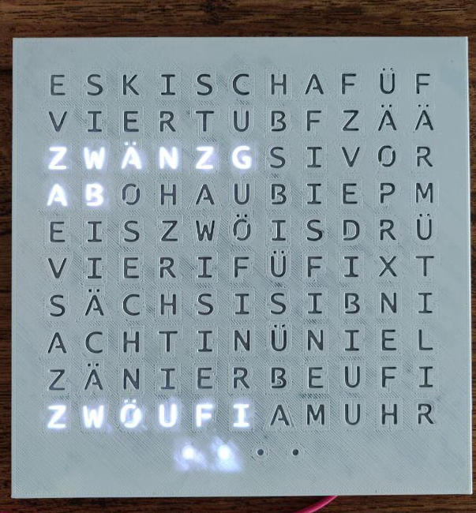

# Wordclock

Display the time in swiss-german.
The clock get the time from the Internet. For this to work, a wifi network is needed.

 

## Configuration

Connect to "WordClock" wifi and go to [http://192.168.4.1](http://192.168.4.1) in a browser. Enter your wifi name (SSID) and your wifi password.
If you want the clock to be off during the night, set the "Night mode" start and end times.

> **Note:** You may need to restart the clock by pressing the "EN" button.

## Menu

To enter the menu, press the "BOOT" button until the "urh" is displayed (it may take up to 15 secs to reach the menu). A single push of the "BOOT" button changes the menu, a long push (< 2 secs) validate the menu selection and trigger the associated actions:
 * uhr: Go back to time display.
 * eis: Check if a new version of the firmware is available and download it.
 * zwöi: Erase the current configuration and switch back to configuration mode.

## Display meanings

 * 1 green dot: Booting.
 * 2 blue dots: Configuration mode.
 * 1 blinking red dot: Error. Press "EN" bouton to restart the clock.
