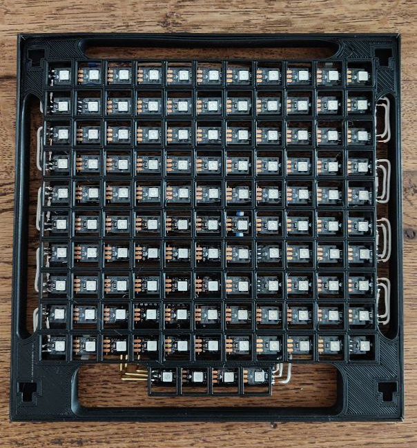

# Wordclock

Display the time in swiss-german, on a custom made hardware.
The clock get the time from the internet. A network connection with WiFI is needed.



## User guide
The [User guide](https://lmayencourt.github.io/wordclock/) is part of the GitHub page documentation.

## Project management
A [GitHub project](https://github.com/users/lmayencourt/projects/1/) is used for tasks management.
The project follow the [Semantic versioning](https://semver.org) scheme.

## Deploy the firmware to an ESP32 board
````
. ~/export-esp.sh
cargo xbuild
espflash /dev/tty.usbserial-0001 crates/cross_compiled/target/xtensa-esp32-espidf/debug/cross_compiled --flash-freq 80M --flash-size 4MB --flash-mode DIO --speed 921600 --partition-table crates/cross_compiled/esp32_ota_partitions.csv
````

Add `--monitor` option to `espflash` to open the serial consol of the device directly after flashing.

Follow the instruction from https://github.com/esp-rs/esp-idf-template to create similar project from template.

## Documentation
`mdbook` is used for rendering the documentation in the `doc/` folder.

It can be generated with:
````
mdbook build
````

To build and open locally the documentation, use:
````
mdbook serve --open
````

A [GitHub page](https://lmayencourt.github.io/wordclock/) host the generated documentation, built automatically by GitHub action on every pull-request.

## Structure of the repository
````
.
|-- 3d printed              // 3d printed part of clock
|-- book.toml               // mdbook configuration for rendering the documentation
|-- Cargo.toml              // Rust workspace configuration
|-- crates                  // Rust source code
|-- doc                     // Project documentation
|-- LICENSE.txt
|-- ota-image               // Firmware Over The Air update image
|-- README.md               // This file
|-- target                  // Build output for Rust binary and documentation
````

## License
Licensed under MIT license ([LICENSE-MIT](LICENSE.txt) or http://opensource.org/licenses/MIT)
